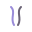
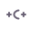
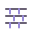

 &nbsp; &nbsp;

# Jingyu Wang

**Agent Builder · Software Engineering · Nanjing University**

I build agents and LLM-powered tools that ship — hand-built from scratch, end to end.

 **Featured Work** 

**Glimmer** &nbsp;

*A lightweight, model-agnostic coding agent harness — built from scratch, with deterministic guardrails and mock-driven testing.*

No framework magic: the agent loop, tooling, and safety rails are hand-built, so every design decision is visible, auditable, and tested.

`Python · TypeScript · Docker` · [repository →](https://github.com/jeannie-jy/Glimmer)

**NJUMatch** &nbsp;

*南京大学在校生专属匹配平台 — soul-questionnaire matching and a full campus community, live in production.*

A real product with real users: I owned the forum module end to end — schema, permission-checked API, front-end — including a five-factor recommendation ranking (MBTI + interest profile + collaborative filtering + freshness + quality) on PostgreSQL full-text search.

`React · TypeScript · Express · PostgreSQL · Docker` · [live →](https://njumatch.com)

**EduFlow-Agent** &nbsp;

*自主 Agent 教学推演系统 — an autonomous multi-agent system for teaching simulation and deduction.*

Agent orchestration applied to a real domain: planning, roles, and teaching logic expressed as executable agent behavior.

`Python · Multi-Agent` · [repository →](https://github.com/jeannie-jy/EduFlow-Agent)

 **Stack** 

 **AI / Agents**

 &nbsp;LLM
&nbsp;&nbsp;&nbsp;&nbsp; &nbsp;Agents
&nbsp;&nbsp;&nbsp;&nbsp; &nbsp;RAG
&nbsp;&nbsp;&nbsp;&nbsp; &nbsp;Tool Calling
&nbsp;&nbsp;&nbsp;&nbsp; &nbsp;Multi-Agent
&nbsp;&nbsp;&nbsp;&nbsp; &nbsp;Evaluation

 **Backend**

 &nbsp;Java
&nbsp;&nbsp;&nbsp;&nbsp; &nbsp;Python
&nbsp;&nbsp;&nbsp;&nbsp; &nbsp;Spring Boot
&nbsp;&nbsp;&nbsp;&nbsp; &nbsp;RESTful API
&nbsp;&nbsp;&nbsp;&nbsp; &nbsp;PostgreSQL
&nbsp;&nbsp;&nbsp;&nbsp; &nbsp;Redis

 **Engineering**

 &nbsp;C++
&nbsp;&nbsp;&nbsp;&nbsp; &nbsp;TypeScript
&nbsp;&nbsp;&nbsp;&nbsp; &nbsp;Git
&nbsp;&nbsp;&nbsp;&nbsp; &nbsp;Linux
&nbsp;&nbsp;&nbsp;&nbsp; &nbsp;Docker
&nbsp;&nbsp;&nbsp;&nbsp; &nbsp;CI/CD

 **Infrastructure**

 &nbsp;MySQL
&nbsp;&nbsp;&nbsp;&nbsp; &nbsp;PostgreSQL
&nbsp;&nbsp;&nbsp;&nbsp; &nbsp;Redis
&nbsp;&nbsp;&nbsp;&nbsp; &nbsp;Kafka
&nbsp;&nbsp;&nbsp;&nbsp; &nbsp;Nginx

 **How I build** 

**Own the loop.**

From prompt to tool to guardrail — understand the whole system.

**Make reliability a feature.**

Deterministic where it matters, tested where it doesn't.

**Ship like it's a product.**

Small, real, finished.

